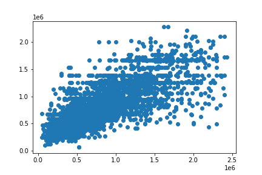

# Exploring Perth House Prices and Predicting Property Values

## Objective: 

The objective of this project is to create a Machine Learning Model that will successfully predict house prices.

### Requirements

* all_perth_310121.csv

### Instructions

### 1. Data Cleaning and PreProcessing.

    * Read in the all_perth_310121.csv Dataset found via Kaggle website.

    * Check the Datatypes and for any null values.
        * GARAGE, BUILD_YEAR and NEAREST_SCH_RANK all presented with Null values. 
        * It was decided NEAREST_SCH_RANK would be dropped. 
        * GARAGE null values would be replaced with (0) value.
        * BUILD_YEAR was given the median year of 1989.
    * Adjust any columns for outlier values.
        * GARAGE, BEDROOMS, BATHROOMS outliers were given the median value for each category. 
        * FLOOR_AREA outliers were replaced with the 25th percentile of the category.
    * Adjust any Datatypes needing to be changed.
        * BUILD_YEAR, GARAGE, BEDROOMS, BATHROOMS and FLOOR_AREA were all set to integer values from Floats. 
        * DATE_SOLD was converted to MONTH_SOLD and YEAR_SOLD.
    * Drop any columns that will not be required for the ML stage.
        * ADDRESS, CBD_DIST, NEAREST_STN_DIST, POSTCODE, DATE_SOLD, LATITUDE , LONGITUDE & NEAREST_SCH_RANK.
    * Confirm all Datatypes are correct and that there are no null values remaining.
    * Use (get_dummies) any relevant columns.
        * SUBURB, NEAREST_STN & NEAREST_SCH were converted using get_dummies.
     

### 2. Split Data.

    * Split Data into X and y vaiables.
        * PRICES will be used as the y_value or target value

### 3. Create Machine Learning Models
    * Review the X and y variables.
    * Split Data into Training and Test datasets.

#### Model 1 - Create a Linear Regression Model 

The Results below show the score, R2 value, MSE value, RMSE and Std Dev values.

A scatter plot of the results was created.

    
#### Model 2 - Create a Decision Tree Regression Model with a Standard Scaler.

    
The Results below show the score, R2 value, MSE value, RMSE and Std Dev values.

A scatter plot of the results was created.

    
    
#### Model 3 - Create a Random Forest Regression Model with a Standard Scaler.

    
The Results below show the score, R2 value, MSE value, RMSE and Std Dev values.

A scatter plot of the results was created.

### Summary 

Of the 3 Regression Models used the Linear Regression Model was the best performer with a score of 77.30%. 

While this is an acceptable score some further training would be required in to order to hopefully reach a better result. This could be achieved by 

* taking a deeper look into the original data to ensure that the dataset is clean, free of outliers, and contains sufficient instances for training. 
* Possibly removing further columns such as the Date columns. 
* Gathering more data, if feasible, can also enhance the model's performance.
* Experimenting with the parameters of both the Decision Tree Model and the Random Forest Model.
 

### 4. Tableau Visualisations

    * The *all_perth_310121.csv* was imported into Tableau to design several visualisations. 
    * THe Following charts were made
        * A map showing all the postcodes in the Perth Area filtered by the average sale price.
        * A tree map showing The Top 10 suburbs by average price.
        * A scatter plot representing the average floor area by average price with bedrooms used as a colour filter.
        * A scatter plot representing the average land area by average price with bedrooms used as a colour filter.
        * An area chart showing the average price by build year.
        * A bar chart showing average price by year sold.
        * Top 10 nearest school count on a horizontal bar chart.
        * Top 10 nearest station count on a horizontal bar chart.  
    * A dashboard was created to represent all charts.

    The Link to my Tableau Public site.
    https://public.tableau.com/app/profile/troy.foote/viz/EXploring_Perth_House_Prices/Dashboard1?publish=yes

### Dependencies

* Python
* Pandas
* Sklearn
* Matplotlib
* Numpy
* Tableau

### References

https://www.kaggle.com/datasets/syuzai/perth-house-prices
Photo by <a href="https://unsplash.com/@maxconacher?utm_source=unsplash&utm_medium=referral&utm_content=creditCopyText">Maximillian Conacher</a> on <a href="https://unsplash.com/images/things/house?utm_source=unsplash&utm_medium=referral&utm_content=creditCopyText">Unsplash</a>
  